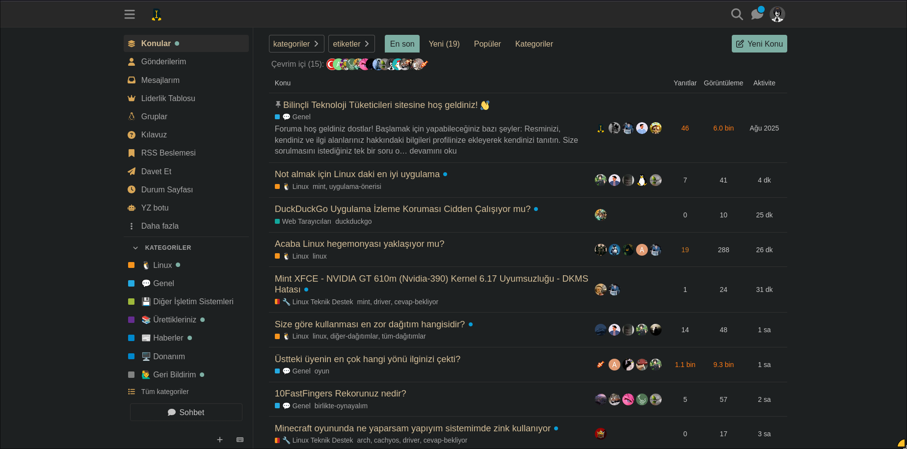
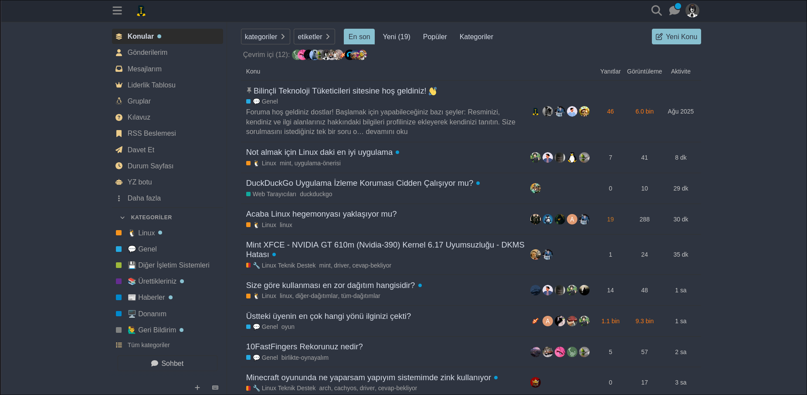
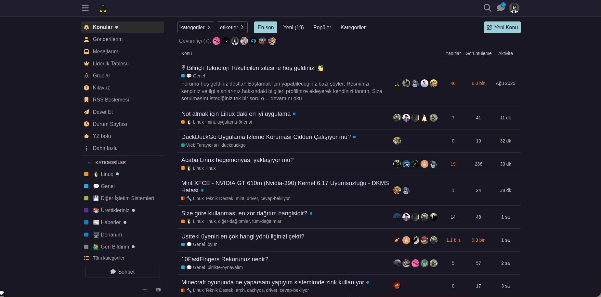

# 🎨 btt.community Ultimate Theme Pack

btt.community  için özel olarak hazırlanmış **Gruvbox**, **Nord** ve **Rosé Pine** temaları.

[English](README-en.md)

---

## 📸 Önizleme

🪵 Gruvbox (Retro & Dark)

❄️ Nord (Arctic & Clean)

🌹 Rosé Pine (Soho Vibes)

---

## 🚀 Kurulum

### 1. Stylus Eklentisini Kur

Temaları kullanabilmek için tarayıcınıza Stylus eklentisini eklemeniz gerekir:

- [Chrome/Brave/Edge için Stylus](https://chrome.google.com/webstore/detail/stylus/clngdbkpkpeebahjckkjfobafhncgmne)
- [Firefox için Stylus](https://addons.mozilla.org/firefox/addon/styl-us/)

### 2. Temayı Yükle

**En Kolay Yöntem:** Userstyles.world üzerinden tek tıkla yükleyebilirsiniz:
- [Rosé Pine Sürümü](https://userstyles.world/style/27994)
- [Gruvbox Sürümü](https://userstyles.world/style/27992)
- [Nord Sürümü](https://userstyles.world/style/27993)

**Manuel Kurulum:**

1. İstediğiniz temanın klasörüne girin ve `theme.user.css` dosyasındaki kodları kopyalayın.
2. Stylus eklentisini açıp **"Yeni Stil Yaz"** (Write new style) butonuna tıklayın.
3. Kopyaladığınız kodları yapıştırın ve **"Kaydet"** butonuna basın.

---
